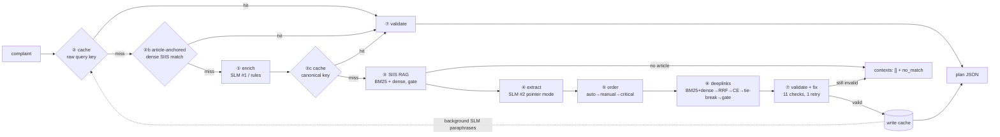

# Smart Guided Troubleshooting Engine (SGTE)

Samsung PRISM GenAI Hackathon 2026 · Theme 2 (Troubleshooting)

Turns a vague Galaxy complaint (*"my screen flickers and the battery dies fast"*) into a validated, ordered,
deeplinked troubleshooting plan, returned as pure JSON in the `schema.py` contract.

## Submission

| | |
|---|---|
| Theme | Theme 2 · Smart Guided Troubleshooting Engine |
| Team | team name, college and members: slide 1 of the presentation |
| Presentation | [docs/SGTE_Submission_Deck.pdf](docs/SGTE_Submission_Deck.pdf) |
| Demo video (≤ 5 min) | https://youtu.be/UWmbvZDs3Ao?si=QjdoR6tNjP7mBOxH |
| Release tag | `PRISM_GENAI_HACKATHON_Y2026` (the tagged commit is the submission) |
| Measured results | [metrics.md](metrics.md) · raw outputs [results.jsonl](results.jsonl) · [bench/report.json](bench/report.json) |
| References | [docs/REFERENCES.md](docs/REFERENCES.md) |

## Contributors

* [@khushichhabra7921](https://github.com/khushichhabra7921)
* [@chintansood](https://github.com/chintansood)
* [@SHRESHTH121](https://github.com/SHRESHTH121)

**Zero cost.** Nothing in this prototype needs a paid service or a GPU. It runs on a CPU laptop with open models:
Ollama (MIT) serving Qwen2.5-1.5B-Instruct (Apache-2.0), all-MiniLM-L6-v2 and ms-marco-MiniLM-L-6-v2
(Apache-2.0), bge-small-en-v1.5 (MIT), FAISS (MIT), FastAPI (MIT). Hosted LLM providers are an optional,
disabled-by-default plug-in (`app/llm_client.py`); the measured cost per query is $0.

**Demo UI.** After `docker compose up`, open `http://localhost:8000/demo`: a phone-style page over the same API
(plan, category badges, one-tap deeplinks, cache hit and latency, evidence trail, raw JSON).

**How the demo video was made (also free).** `scripts/make_demo_video.py` drives the live `/demo` page in headless
Microsoft Edge (Playwright), narrates with Windows' built-in offline voice, reads every number from
`bench/report.json` and a live `pytest` run, and encodes 1080p H.264 with ffmpeg (`imageio-ffmpeg`). Re-generate it
with `pip install -r requirements-video.txt`, then `python scripts/make_demo_video.py` while the API is running.

> **Data note.** The official starter kit was not available, so `data/` holds a **synthetic** kit generated by
> `scripts/make_synthetic_kit.py` (153 masked deeplinks, 60 SIIS-style articles, 106 queries, 101 held-out
> paraphrases, 5 gold samples; every file has `"synthetic": true`). All results below were measured on it.
> Drop the official files into `data/` (adjust only `app/data_loader.py` if field names differ) and
> `python bench/run.py` re-runs unchanged.

**Design principle: LLMs reason, retrieval grounds, deterministic code validates.**

* Known or paraphrased complaints are served from a semantic cache with zero LLM calls.
* New complaints run the full grounded pipeline.
* Steps are never invented: they are copied from source sentences, and anything the model writes is
  fuzzy-checked against the source. Deeplinks are never generated: URIs are only copied from the catalog
  entry whose *metadata* matched. URLs are regex-scrubbed everywhere.
* **LLM placement is measured, not assumed.** On the CPU-only laptop used here the local 1.5B SLM needs
  11–17 s per call, so in `auto` mode it runs *off* the request path: requests use the deterministic grounded
  extractor, and the SLM writes paraphrases in the background that become extra cache keys. A hosted model
  (seconds per call) runs inline for enrichment and extraction. Both full-LLM profiles are one env var away and
  are benchmarked in `metrics.md`.

## Results (measured by `bench/run.py`; full report in [metrics.md](metrics.md))

Synthetic kit, CPU-only laptop (12 logical CPUs, 16.8 GB RAM, Windows 11, plugged in).

| Metric | Target | Measured |
|---|---|---|
| Schema-valid lines in `results.jsonl` | ≥ 99% | 100.0% (106 queries) |
| Rule compliance (all 11 checks) | ≥ 95% | 100.0% |
| URL leaks | 0 | 0 |
| Deeplink catalog validity | 100% | 100.0% (233 deeplinks) |
| Auto actions with a valid deeplink | ≥ 90% | 100.0% |
| Step accuracy on the 5 gold samples | 0–3 | 3.0 |
| Deeplink relevance on the 5 gold samples | 0–2 | 2.0 |
| Exact screen on all 123 SIIS screen actions | – | 100.0% (BM25-only 91.1%, dense-only 65.0%, 1.5B LLM picking from the catalog 10.0% on n=10) |
| Cache hit P95, exact / unseen paraphrase | ≤ 300 ms | 22.8 ms / 24.1 ms (N=95 / 90, 0 LLM calls) |
| Cold query P95 (default auto mode) | ≤ 8 s | 428.5 ms (N=30) |
| Cold query P95, full local-SLM profile inline | ≤ 8 s | 19186.9 ms (N=10) – misses on this CPU, which is why auto mode keeps the local SLM off the request path |
| Paraphrase hit rate, zero-LLM tiers / all tiers (τ=0.85) | ≥ 80% | 84.2% / 86.1% (6 wrong-plan hits of 101; 0 of 12 negatives hit) |
| Routing on `queries.json` | – | single-symptom right article 79/86; multi-symptom both goals 9/10; no-match refused 10/10 |
| Extraction ablation (gold step accuracy) | – | rules 3.0 · SLM pointer 2.701 · SLM generative 1.636 |
| Cost per query | tracked | $0 (local, open models; no paid APIs) |

## Architecture



| Stage | Module | What it does |
|---|---|---|
| ① Enrich | `app/enrich.py` | canonical query, topic, intent, symptom list, 8–10 paraphrases. Rules (slang map + fuzzy typo fix + conjunction split + templates) inline; SLM inline when fast (hosted) or in the background (local CPU). Never writes fixes. |
| ② Cache | `app/cache.py` | FAISS inner-product index over normalised **bge-small-en-v1.5** embeddings (≈3× the paraphrase recall of MiniLM at equal τ), persisted to `cache/`. Tier ② raw-query key (τ), ②b article-anchored (a confident, unambiguous dense SIIS match reuses the validated plan already cached for that article, the same grounding the cold path would use), ②c canonical key after enrichment. Keys = query + canonical + variations → one validated plan. |
| ③ SIIS RAG | `app/retrieve.py` | BM25 + dense (max of article / sentence / title similarity), cross-encoder confirmation; two-signal no-match gate. The article text is the grounding boundary. |
| ④ Extract | `app/extract.py`, `app/steps.py` | Deterministic parser turns each instruction sentence into imperative steps (menu paths → "Tap on X."). **Pointer mode** (hosted default): the LLM only groups numbered units and names them; step text is copied from the source. `rules` (local default): deterministic grouping and naming. `generative`: the LLM writes steps, each fuzzy-grounded against the source or dropped. No LLM schema has a deeplink field. |
| ⑤ Order | `app/order.py` | Rules classify auto / manual / critical (reset, restart, safe mode, firmware → critical; physical → manual); stable sort. |
| ⑥ Deeplinks | `app/deeplinks.py` | BM25 + dense over `description`/`message`/`cna_description` → RRF (k=60) → cross-encoder rerank → tie-break on the deepest named screen → high / medium / low gate (low → `bixby://dummy_positive` if a Settings screen, else none). |
| ⑦ Validate | `app/validate.py` | Pydantic + 11 named checks, deterministic auto-fixers, one retry with errors fed back, else `no_match`. Invalid plans are never cached. |
| Orchestration | `app/pipeline.py` | multi-symptom split (one Goal per distinct article), score, evidence trail, timings, no-match log. |
| API | `app/main.py` | `POST /v1/troubleshoot`, `GET /health` (503 until models, indexes and cache are loaded). |
| LLM swap layer | `app/llm_client.py` | Ollama (default) / Anthropic / OpenAI; temperature 0, seed, JSON-constrained output, timeout, one retry, token cost. |

The 11 checks: `schema`, `goal_format`, `title_format`, `score_range`, `action_name_case`,
`description_format`, `manual_no_deeplink`, `category_order`, `catalog_deeplinks`, `zero_urls`, `query_variations`.

**Score** = calibrated combination of retrieval confidence (dense + cross-encoder), step grounding and deeplink
confidence tiers (`app/pipeline.py::_goal`).

**Evidence trail** (`meta.evidence`, outside the graded schema): per goal, the SIIS article with BM25, dense, RRF rank
and rerank scores; per action, its source sentences, menu path and deeplink decision (BM25, dense, RRF rank, rerank,
specificity, runner-up, margin, tier).

## Quick start (Docker, CPU only)

Requirements: Docker Desktop / Engine with Compose v2, about 8 GB RAM for the containers, about 10 GB disk (Ollama image 5.4 GB,
API image with CPU torch and cached models 2.7 GB, SLM 1 GB). No GPU needed. First build downloads ~9 GB.

```bash
docker compose up --build
```

This will:
1. start Ollama and pull the local SLM (`qwen2.5:1.5b-instruct` by default) into a named volume,
2. build the API image, downloading and caching the embedding model and cross-encoder at build time,
3. pre-warm the semantic cache from `queries.json` + gold samples during the build,
4. serve on `http://localhost:8000`. `/health` returns 503 until everything is loaded, then 200.

```bash
curl -s localhost:8000/health
```

```bash
curl -s -X POST localhost:8000/v1/troubleshoot -H "Content-Type: application/json" -d "{\"query\": \"phone swipe gestures wrong direction after app install\"}"
```

```bash
curl -s -X POST localhost:8000/v1/troubleshoot -H "Content-Type: application/json" -d "{\"query\": \"my screen flickers and the battery dies fast\"}"
```

With your own SIIS text as the grounding boundary:

```bash
curl -s -X POST localhost:8000/v1/troubleshoot -H "Content-Type: application/json" -d "{\"query\": \"screen too dark\", \"siis_response\": \"Open Settings > Display > Brightness and drag the slider to the right. If it is still dark, restart the phone.\"}"
```

## Local development

```bash
python -m venv .venv
```

```bash
.venv/Scripts/pip install torch==2.14.0 --index-url https://download.pytorch.org/whl/cpu
```

```bash
.venv/Scripts/pip install -r requirements.txt
```

```bash
.venv/Scripts/python -m uvicorn app.main:app --port 8000
```

(`.venv/bin/...` on Linux/macOS.) Run Ollama separately (`docker compose up -d ollama ollama-pull`) or set
`SGTE_LLM_PROVIDER=none` for the fully deterministic path.

### Environment variables (all optional; see `app/config.py`)

| Variable | Default | Meaning |
|---|---|---|
| `SGTE_LLM_PROVIDER` | `ollama` | `ollama`, `anthropic`, `openai`, or `none` (deterministic only) |
| `SGTE_LLM_FALLBACK` | empty | second provider tried if the first fails, e.g. `anthropic` |
| `OLLAMA_URL` | `http://localhost:11434` | Ollama endpoint |
| `SGTE_OLLAMA_MODEL` | `qwen2.5:1.5b-instruct` | local SLM tag |
| `ANTHROPIC_API_KEY` / `SGTE_ANTHROPIC_MODEL` | – / `claude-haiku-4-5-20251001` | hosted fallback |
| `OPENAI_API_KEY` / `SGTE_OPENAI_MODEL` | – / `gpt-4o-mini` | hosted fallback |
| `SGTE_EXTRACT_MODE` | `auto` | `auto` (pointer if a hosted LLM is first reachable, else rules), `pointer`, `generative`, `rules` |
| `SGTE_ENRICH_MODE` | `auto` | `auto` (inline if hosted, background if local), `llm`, `background`, `rules` |
| `SGTE_CACHE_TAU` | `0.85` | semantic cache threshold τ (key tier) |
| `SGTE_ANCHOR_CACHE` / `SGTE_ANCHOR_MIN_DENSE` / `SGTE_ANCHOR_MARGIN` | `1` / `0.54` / `0.04` | article-anchored cache tier |
| `SGTE_CACHE_EMBED_MODEL` | `BAAI/bge-small-en-v1.5` | cache embedder |
| `SGTE_EMBED_MODEL` / `SGTE_RERANK_MODEL` | MiniLM-L6-v2 / ms-marco-MiniLM-L-6-v2 | SIIS + deeplink retrieval models |
| `SGTE_TORCH_THREADS` | `4` | CPU threads for embeddings/reranking |
| `SGTE_DATA_DIR`, `SGTE_CACHE_DIR`, `SGTE_LOG_DIR` | `data/`, `cache/`, `logs/` | paths |

No secrets live in code, and none are needed: the default configuration uses only the local, free stack.
*Optional:* a hosted provider can be plugged in through a git-ignored `.env` file in the repo root (read by both
`app/config.py` and `docker compose`, excluded from the Docker build context), e.g. `OPENAI_API_KEY=...` plus
`SGTE_LLM_FALLBACK=openai`, or `SGTE_LLM_PROVIDER=openai` to run enrichment and pointer extraction inline.
This was not used for the submitted results.

## Tests and benchmarks

```bash
.venv/Scripts/python -m pytest
```

Covers the contract and all 11 checks, the auto-fixers, the data-loader adapter, all 5 gold samples end to end,
the `no_match` / `no_siis_context` fallbacks, URL injection, multi-symptom handling, cache-hit latency and the API.

```bash
.venv/Scripts/python bench/run.py
```

Writes `results.jsonl` (one line per `queries.json` query), `metrics.md` and `bench/report.json`.

```bash
.venv/Scripts/python bench/cluster_nomatch.py
```

Clusters logged no-match queries (`logs/no_match.jsonl`) into knowledge-gap themes.

Regenerate the synthetic kit with `python scripts/make_synthetic_kit.py`, and rebuild the cache with
`python scripts/prewarm.py --fresh`.

## Repository layout

```
app/          FastAPI service and pipeline stages (see table above); app/static/demo.html = demo UI
data/         synthetic starter kit + schema.py (single source of truth for the contract)
scripts/      kit generator, cache pre-warm, clean-machine check
bench/        run.py (benchmarks), scoring.py, deeplink_gold.py, metrics_md.py, cluster_nomatch.py, report*.json
tests/        pytest suite
docs/         presentation (PDF) and demo-video script
metrics.md    measured results (generated by bench/run.py)
results.jsonl one line per queries.json query (generated by bench/run.py)
Dockerfile, docker-compose.yml, requirements.txt
```

## Release

The judged submission is the commit tagged `PRISM_GENAI_HACKATHON_Y2026`. After a final change (for example adding
the demo-video link), move the tag to the new commit:

```bash
git tag -f -a PRISM_GENAI_HACKATHON_Y2026 -m "PRISM GenAI Hackathon 2026 submission"
```

```bash
git push origin main && git push -f origin PRISM_GENAI_HACKATHON_Y2026
```

## Limitations (details in metrics.md §6)

* All numbers are on a **synthetic** kit whose SIIS text uses one consistent `Settings > A > B` style; this flatters
  the deterministic parser and screen resolution. The official kit will need `app/steps.py` patterns extended.
* The local 1.5B SLM is too slow on CPU for the request path (≈17–19 s per cold query inline) and, on the gold
  samples, less accurate than the deterministic extractor; a hosted model or a GPU is needed to run SLM #2 inline.
* Cache recall vs precision is a τ trade-off (see the sweep); ~6% of paraphrase hits served a plan grounded in a
  neighbouring article.
* Multi-symptom detection needs a conjunction (rules) or the SLM's symptom list.
* Clean-machine check (`REUSE_OLLAMA=1 bash scripts/clean_check.sh`, a copy of exactly the files a clone contains): `docker compose up --build` → `/health` 200 after 2,314 s including the image build (API ready 36 s after its container started) → swipe complaint 1 goal (cache hit, 52 ms), flicker + battery 2 goals (22 ms), Galaxy Watch complaint `no_match` (344 ms). It ran on the same machine: Docker's layer/image cache was warm and,
  with `REUSE_OLLAMA=1`, the already-downloaded model volume was reused.

