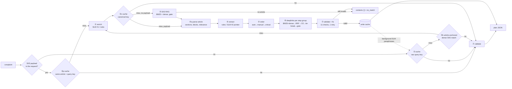

# Smart Guided Troubleshooting Engine (SGTE)

Samsung PRISM GenAI Hackathon 2026 · Theme 2 (Troubleshooting)

Turns a TechCorp Nexa complaint (*"my screen goes completely blank whenever I tap to open an email"*) and the SIIS
article the support system retrieved for it into a validated, ordered, deeplinked troubleshooting plan, returned as
pure JSON in the official `data/schema.py` contract (the shape of `data/sample_output.json`).

## Submission

| | |
|---|---|
| Theme | Theme 2 · Smart Guided Troubleshooting Engine |
| Team | NEXORA, college : Thapar Institute of Engineering and Technology , Patiala 
| Members     |                                Chintan Sood , Avi Garg , Shreshth Garg , Khushi|
| Presentation | [Thapar_Nexora_Theme 2](https://drive.google.com/file/d/1lrZ_x5-y__4H2dkmnwDxnqj3zN7uxhXa/view?usp=sharing) |
| Demo video (≤ 5 min) | https://youtu.be/UWmbvZDs3Ao?si=QjdoR6tNjP7mBOxH |
| Release tag | `PRISM_GENAI_HACKATHON_Y2026` (the tagged commit is the submission) |
| Official-kit outputs | [outputs/](outputs/README.md): one response per `data/input.txt` complaint, sample-output shape · [outputs/report.json](outputs/report.json) |
| Measured results | [metrics.md](metrics.md) (synthetic regression kit) · raw outputs [results.jsonl](results.jsonl) · [bench/report.json](bench/report.json) |
| References | [docs/REFERENCES.md](docs/REFERENCES.md) |


**Zero cost.** Nothing in this prototype needs a paid service or a GPU. It runs on a CPU laptop with open models:
Ollama (MIT) serving Qwen2.5-1.5B-Instruct (Apache-2.0), all-MiniLM-L6-v2 and ms-marco-MiniLM-L-6-v2
(Apache-2.0), bge-small-en-v1.5 (MIT), FAISS (MIT), FastAPI (MIT). Hosted LLM providers are an optional,
disabled-by-default plug-in (`app/llm_client.py`); the measured cost per query is $0.

**Demo UI.** After `docker compose up`, open `http://localhost:8000/demo`: a phone-style page over the same API
(plan, category badges, one-tap deeplinks, cache hit and latency, evidence trail, raw JSON).


**Design principle: LLMs reason, retrieval grounds, deterministic code validates.**

* Known or paraphrased complaints are served from a semantic cache with zero LLM calls.
* New complaints run the full grounded pipeline.
* Steps are never invented: they are copied from source sentences, and anything the model writes is
  fuzzy-checked against the source. Deeplinks are never generated: URIs are only copied from the catalog
  entry whose *metadata* matched. URLs are regex-scrubbed everywhere.
* The SIIS article sent with the request is the only grounding boundary. Numbered procedures (Step 1..N) are kept
  whole; long multi-topic articles (a screen-mirroring guide sent for *"my screen looks small"*) are cut down to the
  paragraph blocks that answer the complaint, and every keep/drop decision is in the evidence trail.
* **LLM placement is measured, not assumed.** On the CPU-only laptop used here the local 1.5B SLM needs
  11–17 s per call, so in `auto` mode it runs *off* the request path: requests use the deterministic grounded
  extractor, and the SLM writes paraphrases in the background that become extra cache keys. A hosted model
  (seconds per call) runs inline for enrichment and extraction. Both full-LLM profiles are one env var away and
  are benchmarked in `metrics.md`.

## Official kit: API contract and results

```
POST /v1/troubleshoot
{"query": "<complaint from input.txt>", "siis_response": {"title": "...", "content": "..."}}
```

The response is `{"query", "query_variations", "response": {"contexts": [...]}, "meta"}`; `response` is validated
against `data/schema.py` before it leaves the service. With `?view=contract` the body is exactly the
`data/sample_output.json` shape, `{"query", "response"}`, in the same key order (goal, title, score, actions;
actionName, description, stepGroups, category; steps, actionableDeeplink, validationDeeplink). `siis_response` may
also be a plain string, or omitted, in which case the engine retrieves from the 11 official articles.

What the engine does with an official payload (`app/siis_text.py`, `app/steps.py`, `app/relevance.py`):

* strips the product-category prefix, splits the markdown into sections (`## Step 2: Verify Your Phone's Internet
  Connection`) and paragraph blocks, drops glossaries, notes and lines whose spaces were lost;
* parses TechCorp phrasing into steps: comma chains (*"go to Settings, tap Display, and then tap Navigation bar"* →
  `Navigate to and open Settings.` / `Tap on Display.` / `Tap on Navigation bar.`), one step per line,
  *"search for and select Factory data reset"*, labels (*"On devices with a Side button: …"*), device conditions
  (*"If your device has a removable battery, …"*), and polite or modal phrasing (*"please remove it"*, *"you may need to
  check …"*), which is trimmed, never paraphrased;
* names an action after its section heading when the heading is an instruction (*Clear the Email App's Cache and
  Data*) or a known procedure (*Safe Mode* → *Start Safe Mode*); a heading such as *Force a Restart* or *Factory Data
  Reset* makes its steps critical;
* gives every navigation from Settings its own step group and deeplink (clear cache, then clear data = 2 groups),
  and a `validationDeeplink` when the catalog entry has a validation key and the steps say which value to expect;
* serves a repeated or paraphrased complaint *with the same article* from the cache (keyed on the article's content
  hash), never a plan built from a different article.

Results on the 20 official complaints (`python bench/official.py`; table and per-row links in
[outputs/README.md](outputs/README.md)):

| Metric | Measured |
|---|---|
| Complaints / distinct SIIS articles in the payloads | 20 / 11 |
| Schema-valid against `data/schema.py` | 100.0% |
| All 11 rule checks pass | 100.0% (0 violations) |
| Plans / `no_match` fallbacks | 20 / 0 |
| Steps supported by the payload text (fuzzy ≥ 80) | 100.0% of 308 steps |
| Actions: auto / manual / critical | 6 / 56 / 16 (critical always last) |
| Actionable deeplinks, all in the catalog | 9 (0 `dummy_positive`); the official articles mostly describe manual and restart steps |
| Cold request P50 / P95 (no cache) | 336.9 / 1511.4 ms |
| Repeat request (payload-scoped cache) | 20/20 hits, P95 27.5 ms, 0 LLM calls |
| Different complaint, same article | 4 served from cache, 5 built fresh (τ = 0.85) |
| `sample_output.json` through the validator | 0 violations |
| Cost per query | $0 (deterministic path; no LLM call on the request path) |

## Results on the synthetic regression kit (measured by `bench/run.py`; full report in [metrics.md](metrics.md))

`data/synthetic/`, CPU-only laptop (12 logical CPUs, 16.8 GB RAM, Windows 11, plugged in).

| Metric | Target | Measured |
|---|---|---|
| Schema-valid lines in `results.jsonl` | ≥ 99% | 100.0% (106 queries) |
| Rule compliance (all 11 checks) | ≥ 95% | 100.0% |
| URL leaks | 0 | 0 |
| Deeplink catalog validity | 100% | 100.0% (236 deeplinks) |
| Auto actions with a valid deeplink | ≥ 90% | 100.0% |
| Step accuracy on the 5 gold samples | 0–3 | 3.0 |
| Deeplink relevance on the 5 gold samples | 0–2 | 2.0 |
| Exact screen on all 123 SIIS screen actions | – | 100.0% (BM25-only 91.1%, dense-only 63.4%, 1.5B LLM picking from the catalog 10.0% on n=10) |
| Cache hit P95, exact / unseen paraphrase | ≤ 300 ms | 20.6 ms / 21.8 ms (N=95 / 88, 0 LLM calls) |
| Cold query P95 (default auto mode) | ≤ 8 s | 377.4 ms (N=30) |
| Cold query P95, full local-SLM profile inline | ≤ 8 s | 19186.9 ms (N=10) – misses on this CPU, which is why auto mode keeps the local SLM off the request path |
| Paraphrase hit rate, zero-LLM tiers / all tiers (τ=0.85) | ≥ 80% | 80.2% / 85.1% (9 wrong-plan hits of 101; 0 of 12 negatives hit) |
| Routing on `queries.json` | – | single-symptom right article 79/86; multi-symptom both goals 9/10; no-match refused 10/10 |
| Extraction ablation (gold step accuracy) | – | rules 3.0 · SLM pointer 2.701 · SLM generative 1.636 |
| Cost per query | tracked | $0 (local, open models; no paid APIs) |

## Architecture



| Stage | Module | What it does |
|---|---|---|
| ① Enrich | `app/enrich.py` | canonical query, topic, intent, symptom list, 8–10 paraphrases. Rules (slang map + fuzzy typo fix + conjunction split + templates) inline; SLM inline when fast (hosted) or in the background (local CPU). Never writes fixes. |
| ② Cache | `app/cache.py` | FAISS inner-product index over normalised **bge-small-en-v1.5** embeddings (≈3× the paraphrase recall of MiniLM at equal τ), persisted to `cache/`. Tier ② raw-query key (τ), ②b article-anchored (a confident, unambiguous dense SIIS match reuses the validated plan already cached for that article, the same grounding the cold path would use), ②c canonical key after enrichment. Keys = query + canonical + variations → one validated plan. |
| ③ SIIS RAG | `app/retrieve.py` | Only when no payload is sent: BM25 + dense (max of article / sentence / title similarity), cross-encoder confirmation; two-signal no-match gate. The article text is the grounding boundary. |
| ④a Article | `app/siis_text.py`, `app/relevance.py` | Official `{title, content}` payload → clean sectioned article (prefix, headings, step lines, garbled lines). Numbered procedures and short articles are kept whole; otherwise paragraph blocks within 3 cross-encoder logits or 0.07 cosine of the best block are kept, at most 6 actions. |
| ④ Extract | `app/extract.py`, `app/steps.py` | Deterministic parser turns each instruction sentence into imperative steps (`Settings > A > B` paths and TechCorp comma chains → "Tap on X."). **Pointer mode** (hosted default): the LLM only groups numbered units and names them; step text is copied from the source. `rules` (local default): deterministic grouping and naming (section headings name actions). `generative`: the LLM writes steps, each fuzzy-grounded against the source or dropped. No LLM schema has a deeplink field. |
| ⑤ Order | `app/order.py` | Rules classify auto / manual / critical (reset, restart, safe mode, firmware → critical; physical → manual); stable sort. |
| ⑥ Deeplinks | `app/deeplinks.py` | Per step group: BM25 + dense over `description`/`message`/`cna_description` → RRF (k=60) → cross-encoder rerank → tie-break on the deepest named screen → high / medium / low gate (low → `voiceassist://dummy_positive` if a Settings screen, else none). `validationDeeplink` (key, result type, condition, value) only when the entry has one and the steps state the expected value. |
| ⑦ Validate | `app/validate.py` | Pydantic + 11 named checks, deterministic auto-fixers, one retry with errors fed back, else `no_match`. Invalid plans are never cached. |
| Orchestration | `app/pipeline.py` | payload or retrieval grounding, multi-symptom split (one Goal per distinct article), score, evidence trail, timings, no-match log. |
| API | `app/main.py` | `POST /v1/troubleshoot` (`?view=contract` = sample-output shape), `GET /v1/examples` (official complaints + payloads), `GET /health` (503 until models, indexes and cache are loaded). |
| LLM swap layer | `app/llm_client.py` | Ollama (default) / Anthropic / OpenAI; temperature 0, seed, JSON-constrained output, timeout, one retry, token cost. |

The 11 checks: `schema`, `goal_format`, `title_format`, `score_range`, `action_name_case`,
`description_format`, `manual_no_deeplink`, `category_order`, `catalog_deeplinks`, `zero_urls`, `query_variations`.

**Score** = calibrated combination of retrieval confidence (dense + cross-encoder; for a payload, of its best kept
block), step grounding and deeplink confidence tiers (`app/pipeline.py::_goal`).

**Evidence trail** (`meta.evidence`, outside the graded schema): per goal, the SIIS article (retrieval scores, or the
payload's title and content hash) and the relevance score and keep/drop decision of every instruction block; per
action, its section, source sentences, menu path and deeplink decision (BM25, dense, RRF rank, rerank, specificity,
runner-up, margin, tier).

## Quick start (Docker, CPU only)

Requirements: Docker Desktop / Engine with Compose v2, about 8 GB RAM for the containers, about 10 GB disk (Ollama image 5.4 GB,
API image with CPU torch and cached models 2.7 GB, SLM 1 GB). No GPU needed. First build downloads ~9 GB.

```bash
docker compose up --build
```

This will:
1. start Ollama and pull the local SLM (`qwen2.5:1.5b-instruct` by default) into a named volume,
2. build the API image, downloading and caching the embedding model and cross-encoder at build time,
3. pre-warm the semantic cache during the build from the official kit (each `input.txt` complaint with its SIIS
   payload, then as free text),
4. serve on `http://localhost:8000`. `/health` returns 503 until everything is loaded, then 200.

```bash
curl -s localhost:8000/health
```

The official contract, a complaint with its SIIS payload (`?view=contract` returns only `{"query", "response"}`):

```bash
curl -s -X POST "localhost:8000/v1/troubleshoot?view=contract" -H "Content-Type: application/json" -d "{\"query\": \"My Nexa X1 screen inputs are delayed and the touch is laggy\", \"siis_response\": {\"title\": \"Touchscreen issues on a smartphone or tablet\", \"content\": \"## 5. Touch Sensitivity Setting\nTo turn off this feature, navigate to Settings, tap Display, and then tap the switch next to Touch sensitivity to disable it.\"}}"
```

All 20 official complaints with their payloads, as the judges' harness would send them:

```bash
curl -s localhost:8000/v1/examples
```

A free-text complaint (no payload: the engine retrieves from the official articles):

```bash
curl -s -X POST localhost:8000/v1/troubleshoot -H "Content-Type: application/json" -d "{\"query\": \"my screen went completely black\"}"
```

## Local development

```bash
python -m venv .venv
```

```bash
.venv/Scripts/pip install torch==2.14.0 --index-url https://download.pytorch.org/whl/cpu
```

```bash
.venv/Scripts/pip install -r requirements.txt
```

```bash
.venv/Scripts/python -m uvicorn app.main:app --port 8000
```

(`.venv/bin/...` on Linux/macOS.) Run Ollama separately (`docker compose up -d ollama ollama-pull`) or set
`SGTE_LLM_PROVIDER=none` for the fully deterministic path.

### Environment variables (all optional; see `app/config.py`)

| Variable | Default | Meaning |
|---|---|---|
| `SGTE_LLM_PROVIDER` | `ollama` | `ollama`, `anthropic`, `openai`, or `none` (deterministic only) |
| `SGTE_LLM_FALLBACK` | empty | second provider tried if the first fails, e.g. `anthropic` |
| `OLLAMA_URL` | `http://localhost:11434` | Ollama endpoint |
| `SGTE_OLLAMA_MODEL` | `qwen2.5:1.5b-instruct` | local SLM tag |
| `ANTHROPIC_API_KEY` / `SGTE_ANTHROPIC_MODEL` | – / `claude-haiku-4-5-20251001` | hosted fallback |
| `OPENAI_API_KEY` / `SGTE_OPENAI_MODEL` | – / `gpt-4o-mini` | hosted fallback |
| `SGTE_EXTRACT_MODE` | `auto` | `auto` (pointer if a hosted LLM is first reachable, else rules), `pointer`, `generative`, `rules` |
| `SGTE_ENRICH_MODE` | `auto` | `auto` (inline if hosted, background if local), `llm`, `background`, `rules` |
| `SGTE_CACHE_TAU` | `0.85` | semantic cache threshold τ (key tier) |
| `SGTE_ANCHOR_CACHE` / `SGTE_ANCHOR_MIN_DENSE` / `SGTE_ANCHOR_MARGIN` | `1` / `0.54` / `0.04` | article-anchored cache tier |
| `SGTE_CACHE_EMBED_MODEL` | `BAAI/bge-small-en-v1.5` | cache embedder |
| `SGTE_EMBED_MODEL` / `SGTE_RERANK_MODEL` | MiniLM-L6-v2 / ms-marco-MiniLM-L-6-v2 | SIIS + deeplink retrieval models |
| `SGTE_TORCH_THREADS` | `4` | CPU threads for embeddings/reranking |
| `SGTE_REL_KEEP_ALL` / `SGTE_REL_CE_DELTA` / `SGTE_REL_DENSE_DELTA` / `SGTE_REL_MAX_ACTIONS` | `3` / `3.0` / `0.07` / `6` | relevance inside a long SIIS article (`app/relevance.py`) |
| `SGTE_DESC_MAX_WORDS` | `12` | longest accepted action description (the generator writes 5–7 words; the official sample uses 9 and 12) |
| `SGTE_DUMMY_DEEPLINK` | `voiceassist://dummy_positive` | returned for a Settings screen named in the article but missing from the catalog |
| `SGTE_DATA_DIR`, `SGTE_CACHE_DIR`, `SGTE_LOG_DIR` | `data/`, `cache/`, `logs/` | paths |

No secrets live in code, and none are needed: the default configuration uses only the local, free stack.
*Optional:* a hosted provider can be plugged in through a git-ignored `.env` file in the repo root (read by both
`app/config.py` and `docker compose`, excluded from the Docker build context), e.g. `OPENAI_API_KEY=...` plus
`SGTE_LLM_FALLBACK=openai`, or `SGTE_LLM_PROVIDER=openai` to run enrichment and pointer extraction inline.
This was not used for the submitted results.

## Tests and benchmarks

```bash
.venv/Scripts/python -m pytest
```

69 tests. Official kit (`tests/test_official.py`): all 20 complaints with their payloads are schema-valid, pass
the 11 checks, and every step is grounded in its payload; key order equals `sample_output.json`; a multi-topic
article keeps only the relevant tip; two navigations give two step groups; the payload cache never crosses
articles; `sample_output.json` itself passes every check. Synthetic regression kit: the contract and all 11 checks,
the auto-fixers, the data-loader adapter, all 5 gold samples end to end, the `no_match` / `no_siis_context`
fallbacks, URL injection, multi-symptom handling, cache-hit latency and the API.

```bash
.venv/Scripts/python bench/official.py
```

Runs every `data/input.txt` complaint with its payload and writes `outputs/<row>.json` (sample-output shape),
`outputs/all.json`, `outputs/report.json` and `outputs/README.md`.

```bash
.venv/Scripts/python bench/run.py
```

Runs on the synthetic regression kit and writes `results.jsonl` (one line per `data/synthetic/queries.json`
query), `metrics.md` and `bench/report.json`.

```bash
.venv/Scripts/python bench/cluster_nomatch.py
```

Clusters logged no-match queries (`logs/no_match.jsonl`) into knowledge-gap themes.

Regenerate the synthetic kit with `python scripts/make_synthetic_kit.py`, and rebuild the cache with
`python scripts/prewarm.py --fresh`.

## Repository layout

```
app/          FastAPI service and pipeline stages (see table above); app/static/demo.html = demo UI
data/         official kit (input.txt, siis_responses.json, sample_output.json, schema.py), deeplinks.json
              (synthetic catalog), synthetic/ (regression kit)
outputs/      one response per official complaint (generated by bench/official.py)
scripts/      kit generator, cache pre-warm, clean-machine check
bench/        official.py (official kit), run.py (synthetic benchmarks), scoring.py, deeplink_gold.py,
              metrics_md.py, cluster_nomatch.py, report*.json
tests/        pytest suite
docs/         presentation (PDF) and demo-video script
metrics.md    measured results (generated by bench/run.py)
results.jsonl one line per synthetic query (generated by bench/run.py)
Dockerfile, docker-compose.yml, requirements.txt
```

## Release

The judged submission is the commit tagged `PRISM_GENAI_HACKATHON_Y2026`. After a final change (for example adding
the demo-video link), move the tag to the new commit:

```bash
git tag -f -a PRISM_GENAI_HACKATHON_Y2026 -m "PRISM GenAI Hackathon 2026 submission"
```

```bash
git push origin main && git push -f origin PRISM_GENAI_HACKATHON_Y2026
```

## Limitations (details in metrics.md §6)

* The official kit ships **no deeplink catalog and no gold plans**. Deeplinks come from a synthetic catalog (154
  screens; one real entry), so on official articles we can measure contract compliance, grounding and catalog
  validity, not deeplink or step accuracy against a gold answer. `sample_output.json` has no SIIS payload in the kit
  and its back-up step is not in any of the 11 official articles, so it cannot be reproduced (our free-text plan for
  its query is in `outputs/sample_query.json`, scored against it in `outputs/report.json`).
* Relevance inside long articles relies on the ms-marco cross-encoder, whose scores are poorly calibrated on this
  text (a black-screen complaint scores *Force a Restart* at about −10). Numbered procedures are therefore kept whole,
  and which part of a multi-topic guide answers an off-topic payload (row_7: a Multi window guide for a dark-screen
  complaint) is a heuristic choice. Plans for whole procedures can be long (row_21: 11 actions).
* The official articles mostly describe manual or restart steps: 6 of the 78 official actions open a Settings
  screen, so most official actions correctly carry no deeplink.
* The synthetic regression kit's SIIS text uses one consistent `Settings > A > B` style, which flatters the
  deterministic parser and screen resolution; its numbers are not official-kit numbers.
* The local 1.5B SLM is too slow on CPU for the request path (≈17–19 s per cold query inline) and, on the gold
  samples, less accurate than the deterministic extractor; a hosted model or a GPU is needed to run SLM #2 inline.
* Cache recall vs precision is a τ trade-off (see the sweep); on the synthetic kit 9 of 101 paraphrases (~9% of
  hits) were served a plan grounded in a neighbouring article. With an official payload this cannot happen: the
  cache only serves plans built from the same article.
* Multi-symptom detection needs a conjunction (rules) or the SLM's symptom list.
* Clean-machine check (`REUSE_OLLAMA=1 bash scripts/clean_check.sh`, a copy of exactly the files a clone contains),
  last measured **before** the official-kit migration: `docker compose up --build` → `/health` 200 after 2,314 s
  including the image build (API ready 36 s after its container started). The script now also sends an official
  complaint with its payload; it has not been re-run since the migration.

